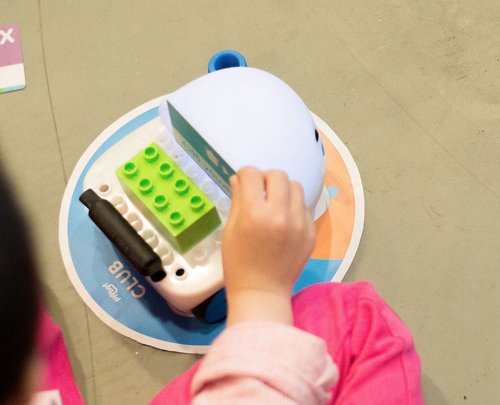
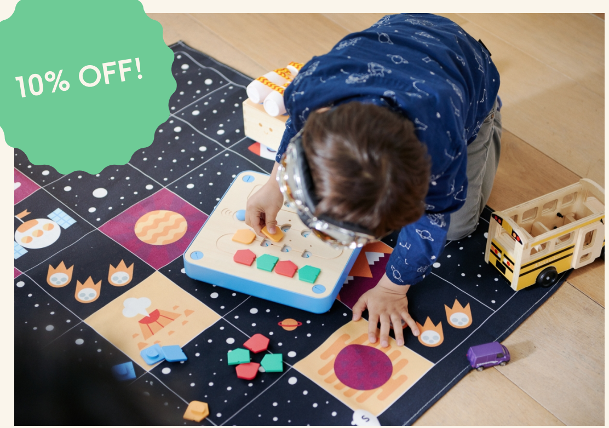
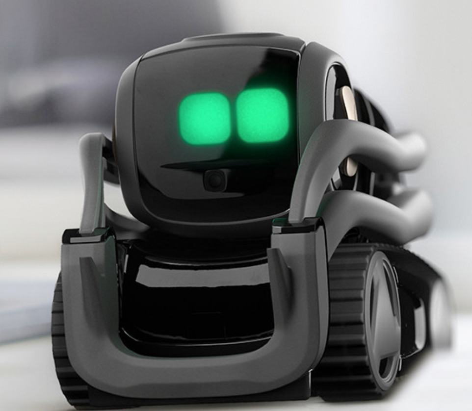

# ProgrammingToy

# ProgrammingToys

### behance
https://www.behance.net/gallery/45476023/Plobot-tangible-programming-robot-toy

刷卡编程。原理为顺序式编程，机器人执行指令序列。

### PRIMO
https://www.primotoys.com/

积木编程，指令集顺序执行

### ANKI

https://www.anki.com/en-us/vector
纯硬件，设备很贵

### LEGO
https://www.lego.com/en-us/mindstorms/learn-to-program
乐高

